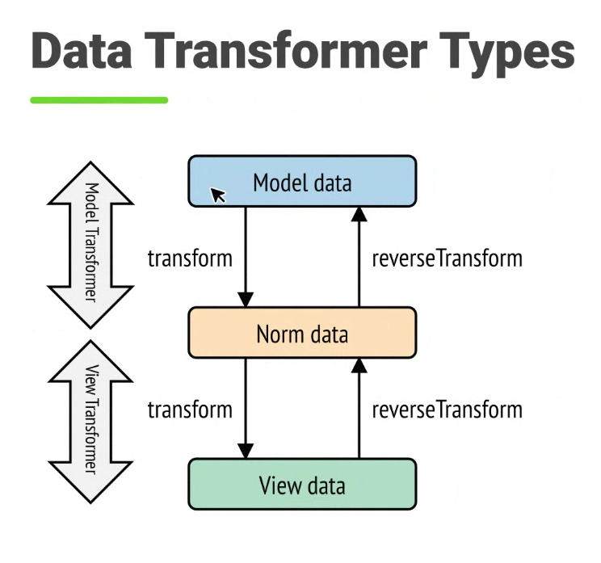

# Forms

Gère l'affichage des champs de formulaire **et** le traitement du formulaire (récupération des user inputs).

- Formulaires réutilisables (et validation également)
- Data mapping
- Customizable (fonctionnellement et design)
- Validation Integration

## Créer un formulaire

## Gérer l'envoi des données

`Form::handleRequest()` gère les données envoyées (et vérifie si des données ont été envoyées) **et les valide**.

Form::submit() pour :
- stocker les données dans les form data (objet ou tableau)
- déclenche des événements (dont la validation)

## Form Types

On implémente `FormTypeInterface` pour tout FormType (caché par `AbstractForm` la plupart du temps) !
Donc 6 méthodes obligatoires, implémentées par `AbstractForm` (Attention buildView() vient avant finishView()).

## Form rendering

- `form_start()` pour ouvrir le tag <form>
- `form_end()` pour fermer le tag <form> **et** rendre les champs non rendus
- `form_widget()` pour afficher un champ (pas label et error, mais `input`)
- `form_errors()` pour afficher les erreurs
- `form_label()` pour afficher le label
- `form_help()` pour le helper
- `form_row()` pour le label, widget, help et erreurs (dans cet ordre)
- `form_rest()` pour rendre ce qui n'a pas été rendu (sans fermer le tag form)
- `form()` pour afficher **tout** le formulaire
- `field_name()` pour récupérer un élément **d'un** champ
- `field_value()` pour récupérer un élément **d'un** champ
- `field_label()` pour récupérer un élément **d'un** champ
- `field_choices()` pour récupérer les choix d'un champ

## Form theming

Des thèmes sont fournis par défaut (Bootstrap, Foundation, Tailwind, div, etc.).

Applicable globalement (config de Twig) ou sur un template ``, voir sur un champ ``.

On peut appliquer un thème "local" avec `` (block défini dans le même template).

On peut surcharger des thèmes avec `` pour venir ajouter des modifications.

## CSRF Protection

CSRF : Cross-Site Request Forgery
Soumissions de requêtes qui ne viennent pas de notre site.
Génération d'un token (chaine aléatoire) qui est ajouté dans un formulaire (champs _csrf_token, par exemple) et vérification de ce token lors de la soumission.

Option `csrf_protection` sur tous les FormType.

## File upload

## Data transformers

Conversion de la donnée entre la soumission du form et l'affichage.

Exemple avec les dates :
- DateType (prend un DateTime)
- string (ou strings) pour afficher la date

Dans l'autre sens, lors de la soumission :
- On reçoit une (ou des) chaines
- On veut passer en model data (DateTime)

- `transform()` pour passer de model à view
- `reverseTransform()` pour passer de view à model

- `->addModelTransformer()` pour transformer dans les deux sens
- `->addViewTransformer()` pour transformer le model en view data

## Form Events

- `PRE_SET_DATA` : avant l'ajout des données au formulaire
- `POST_SET_DATA` : après l'ajout des données au formulaire
- `PRE_SUBMIT` : Avant le mappage des données
- `SUBMIT` : Pendant le mapping
- `POST_SUBMIT` : Après la soumission et le mapping

## Form Extensions

## Questions

`empty_data` donne une valeur au champ si une valeur soumise est vide ! (et non pas une valeur par défaut au champ)

